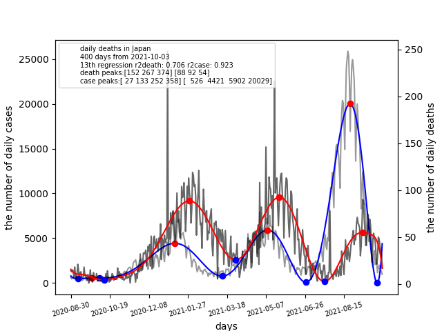

# covidlag
Data science is useful to investigate the progression of the pandemic. 
This repository proposes a new tool covidlag for analyzing a lag time 
between infection peaks and death peaks. 
Covidlang is a open-source program which can provide the lag time and 
the death rate per infection.

# How to install covidlag
Covidlag is available in public and can be installed by the PyPI packaging:
$ pip install covidlag

# How to run covidlag
Run the following command composed of the country name, sampled days, the degree
of polynomial curve-fitting, and options (L: left, R: right, C: center):
$ covidlag Japan 400 13 L

