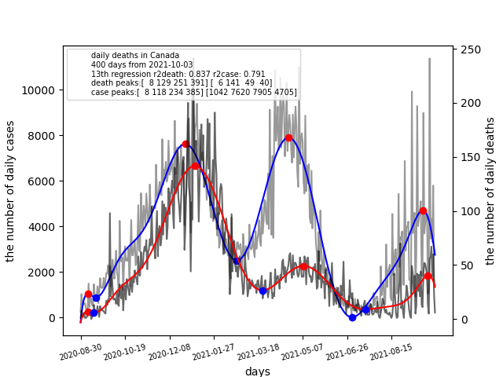

# covidlag
Data science is useful to investigate the progression of the pandemic. 
This repository proposes a new tool covidlag for analyzing a lag time 
between infection peaks and death peaks. 
Covidlang is a open-source program which can provide the lag time and 
the death rate per infection.

Polynomial curve-fitting algorithm is used for detecting infection peaks and death peaks.
The lag time is a difference between a infection peak and a death peak.
The average death rate per infection can be also calculated.
In shorter lag time, we must treat infected patients in urgent manners.
In longer lag time, we must provide sufficient hospital accomodation.
In higher death rate per infection, we must strengthen policies.

# How to install covidlag
Covidlag is available in public and can be installed by the PyPI packaging:

$ pip install covidlag

# How to run covidlag
Run the following command composed of the country name, sampled days, the degree
of polynomial curve-fitting, and options (L: left, R: right, C: center):

$ covidlag Japan 400 13 L

This example shows the 13th degree polynomial curve-fitting using 400 days has 
r-squared of infections:0.923 and r-squared of deaths:0.706.
<pre>
The death peaks are [152 267 374].
death peak: 2021-01-29 <-
death peak: 2021-05-24 <-
death peak: 2021-09-08 <-

The case peaks are [27 133 252 258].
case peak: 2020-09-26
case peak: 2021-01-10 <-
case peak: 2021-05-09 <-
case peak: 2021-08-23 <-
</pre>

The number of death peak is [88 92 54].

The number of case peak is [526 4421 5902 20029]

Therefore, death rate of peaks is 88/4421=0.019, 92/5902=0.015, 54/20029=0.0026 respectively.

$ covidlag 'United States' 600 13 L

This example shows that r-squared of infections: and r-squared of deaths:

death peak: 2020-04-23
death peak: 2020-08-19
death peak: 2021-01-14
death peak: 2021-05-27
death peak: 2021-09-13
case peak: 2020-04-04
case peak: 2020-07-17
case peak: 2020-12-23
case peak: 2021-05-05
case peak: 2021-08-31

$ covidlag Canada 400 13 L

death peak: 2020-09-07
death peak: 2021-01-06
death peak: 2021-05-08
death peak: 2021-09-25
case peak: 2020-09-07
case peak: 2020-12-26
case peak: 2021-04-21
case peak: 2021-09-19
